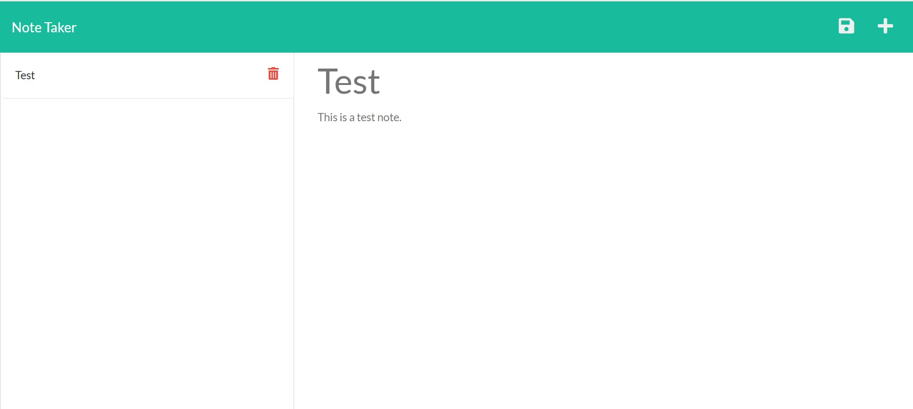

# Mediocre-NoteTaker

  

  # Description
  
  A webpage deployed on Heroku using Express.js for the web framework. The webpage is a Note Taker that stores and deletes notes using a database in the backend. Users input their own notes on the page.

  # Table of Contents
  
  - [Installation](#installation)
  - [Usage](#usage)
  - [Deployed Application](#deployed-application)
  - [Tests](#tests)
  - [Questions](#questions)

  # Installation
  
  For running the code locally, node.js, express.js and npm package uuid. A server is required to run the application over the internet.

  # Usage
  
  
  
  # Deployed Application

  Link to deployed application:  [https://rocky-mountain-97867.herokuapp.com/](https://rocky-mountain-97867.herokuapp.com/)

  Note: The webpage is affected on Google Chrome due to CORS policy but it works fine on Microsoft Edge.

  # Tests
  
  None.

  # Questions
  
  You can find my GitHub profile at: https://github.com/r134x7

  If you have any questions, you can contact me by email: r134x7@gmx.com

